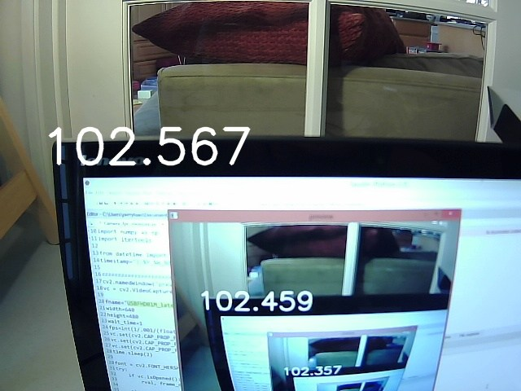

# Webcam-Latency-Measurement
Script for measuring latency of USB webcams

This is a short python script that can be used to measure the latency and frame rate for a USB camera. It works
by displaying a time on the screen, and then displaying the image from a USB camera that is point on the screen. 
The difference between the time shown on the screen and the from the iage in the USB camera is the latency.  The 
FPS is printed in the console.  

The image will look something like this:

To take a snapshot of the image and save it as a .jpg, press the spacebar.  ESC exits and quits program. 

You may need to edit the number for the videocam to get the right one on your system.  

It requires the OpenCV2 package. 

[More info on usage and some results](https://www.makehardware.com/2016/03/29/finding-a-low-latency-webcam/)

